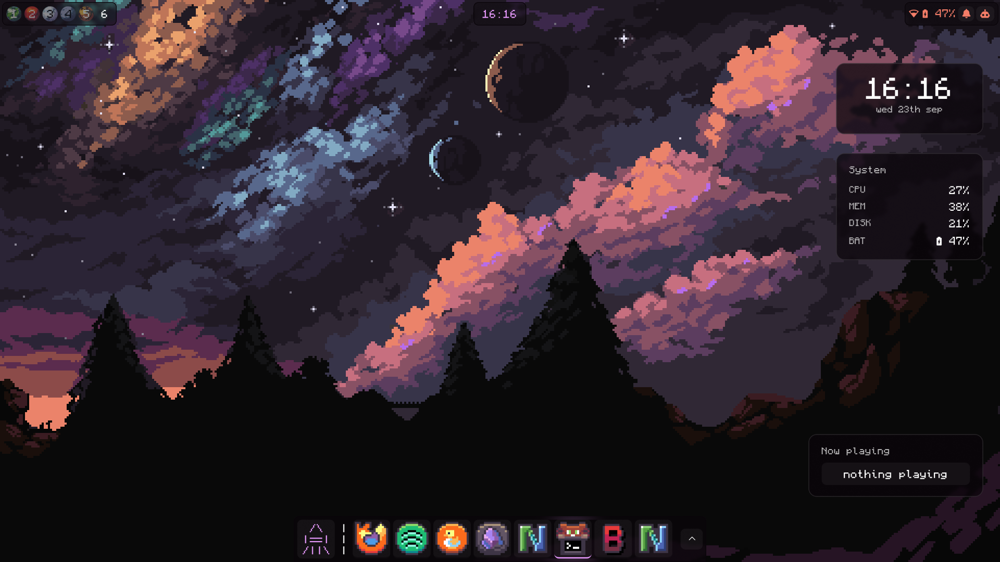

# zaydaansayed's rice

Hyprland + eww desktop rice with two themes (`night_sky`, `default_dark`),
a spotlight launcher, desktop widgets, and a one-command setup script.



## Highlights

- **Bar + dock** (eww) — workspaces (dynamic buttons past 5), player, clock,
  battery/network/Bluetooth, quick settings, OBS recording indicator
- **Spotlight launcher** (`SUPER+SPACE`) — apps (most-used first), file search,
  web-search fallback, per-app web lookup, pin to dock + menu
- **Desktop widgets** — clock, system monitor, now-playing (positions editable
  in `eww/yuck/widgets.yuck`)
- **Settings window** — Wi-Fi, Bluetooth, DNS, audio, themes, plus a System page
  (brightness, awake mode, wallpaper cycler)
- **Main menu** — pinned apps shared with the dock (pin/unpin live)
- **Keybinds window** — via the Rice Keybinds app entry
- **Emoji picker** (`SUPER+.`) — offline, copies + types your pick
- **Awake mode** (`SUPER+I`) — toggles hypridle auto dim/lock with restart
- **Zen mode** (`SUPER+E`) — borderless look toggle (gaps 0, 1px white border)
- **Setup window + script** — `setup.sh [deps|link|theme|apps|all]` for new machines

## Install

```bash
git clone <your-repo-url> ~/dotfiles
cd ~/dotfiles
./setup.sh all        # needs sudo for packages (or run steps separately)
```

Then log out and pick the **Hyprland** session.

## Keybinds

| Bind | Action |
| ---- | ------ |
| SUPER+A | terminal (kitty) |
| SUPER+S | close window |
| SUPER+M | shutdown menu |
| SUPER+L | lock |
| SUPER+I | awake mode (no auto dim/lock) |
| SUPER+E | borderless zen mode |
| SUPER+F | float toggle |
| SUPER+P / D | pseudotile / togglesplit |
| SUPER+SPACE | spotlight launcher |
| SUPER+V | clipboard history |
| SUPER+. | emoji picker |
| SUPER+1..0 | workspaces (SHIFT moves window) |
| SUPER+C | scratchpad |
| 3-finger horizontal | switch workspace |

Full list lives in the Rice Keybinds app and `.config/hypr/modules/input_keybinds.lua`.

## Layout

```text
.config/
  hypr/            Hyprland Lua config (hyprland.lua + modules/)
  eww/             widgets + scripts (yuck/, scss/, scripts/)
  eww/themes/      night_sky + default_dark (application.sh applies a theme)
applications/      .desktop entries (installed by setup.sh link)
setup.sh           new-machine setup (deps/link/theme/apps)
preview.png        screenshot for posts like this one
support.md         contact + issue links
```

Theme files are generated — `application.sh` rewrites `eww/eww.yuck` and
`eww/eww.scss`, so edit the theme sources, not the generated files.
Shared windows (launcher, emoji, keybinds, setup, widgets) live in
`eww/yuck/` + `eww/scss/` so both themes get them automatically.

## Support

See [SUPPORT.md](support.md). Issues welcome.
